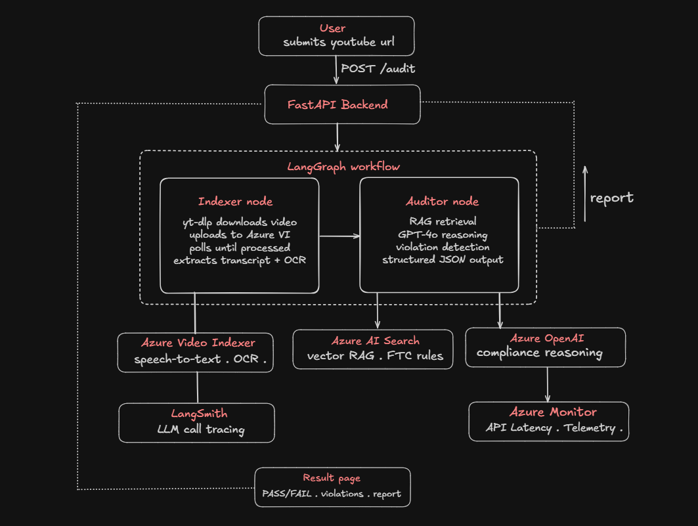

# Multimodal Video Compliance Auditor

An AI-powered pipeline that automatically audits YouTube video advertisements for regulatory and brand compliance, using multimodal understanding, retrieval-augmented generation (RAG), and agentic workflow orchestration. 

Drop in a YouTube URL - the system downloads the video, extracts speech transcripts and on-screen text via Azure Video Indexer, retrieves relevant FTC and platform policy rules from a vector knowledge base, and lets GPT-4o reason over all of it to produce a structured compliance report with pass/fail decisions and per-violation severity ratings along with supporting evidence.

---

##Demo

https://youtu.be/BFPnt0vG3_U

---

## 1) Tech Stack

| Layer | Technologies |
| :--- | :--- |
 **Backend** | Python 3.13 , FastAPI , LangGraph , LangChain  |
| **AI & Orchestration** | Azure Video Indexer (transcript + OCR) , Azure OpenAI GPT-4o , Azure AI Search (RAG) |
| **Observability** | LangSmith , Azure Monitor |
| **Frontend & Routing** | Next.js , Tailwind CSS , shadcn/ui |

---

## 2) Architecture & System Design

### System Overview Diagram



### Core System Components

**Video Processing Layer**
Downloads YouTube videos via yt-dlp, uploads to Azure Video Indexer, and extracts speech transcript, OCR text, and visual metadata.

**Knowledge Base (RAG)**
FTC influencer guidelines and YouTube ad policy PDFs are chunked, embedded via `text-embedding-3-small`, and stored in Azure AI Search for semantic retrieval at audit time.

**LangGraph Workflow**
Two-node DAG: Indexer node handles video ingestion and extraction, Auditor node handles RAG retrieval and GPT-4o compliance reasoning. Each node is isolated and independently extensible.

**Compliance Reasoning Engine**
GPT-4o evaluates the transcript and OCR against retrieved FTC rules, checking for missing disclosures, unsubstantiated claims, misleading content, trademark misuse, and more. Returns structured JSON with per-violation severity ratings.

**Observability**
LangSmith traces every LLM call end-to-end. Azure Application Insights captures API latency, failures, and telemetry.


---

## 3) Getting Started

### Prerequisites
- Python 3.13+
- Node.js 18+
- Azure account with: OpenAI, Video Indexer, AI Search, Application Insights
- Azure CLI installed and logged in (`az login`)

### Clone Repository
```bash
git clone https://github.com/yourusername/multimodal-video-compliance-auditor.git
cd multimodal-video-compliance-auditor
```


### Backend Setup
```bash
cd ComplianceQAPipeline
uv sync
```

Create .env file:
```env
AZURE_OPENAI_API_KEY=
AZURE_OPENAI_ENDPOINT=
AZURE_OPENAI_API_VERSION=
AZURE_OPENAI_CHAT_DEPLOYMENT=
AZURE_OPENAI_EMBEDDING_DEPLOYMENT=

AZURE_SEARCH_ENDPOINT=
AZURE_SEARCH_API_KEY=
AZURE_SEARCH_INDEX_NAME=

AZURE_VI_NAME=
AZURE_VI_LOCATION=
AZURE_VI_ACCOUNT_ID=
AZURE_SUBSCRIPTION_ID=
AZURE_RESOURCE_GROUP=

APPLICATIONINSIGHTS_CONNECTION_STRING=

LANGCHAIN_TRACING_V2=true
LANGCHAIN_ENDPOINT=
LANGCHAIN_API_KEY=
LANGCHAIN_PROJECT=
```

Index the compliance PDFs:
```bash
uv run python backend/scripts/index_documents.py
```

Start the backend:
```bash
uv run uvicorn backend.src.api.server:app --reload
```
### Frontend Setup
```bash
cd frontend
npm install
npm run dev
```

Open **http://localhost:3000**

---

## 4) API

**POST** `/audit`
```json
{ "video_url": "https://youtu.be/..." }
```

Response:
```json
{
  "session_id": "uuid",
  "video_id": "vid_xxxxxxxx",
  "status": "FAIL",
  "compliance_results": [
    {
      "category": "FTC Disclosure",
      "severity": "CRITICAL",
      "description": "No paid partnership disclosure found..."
    }
  ],
  "final_report": "Summary of findings and recommended actions..."
}
```

**GET** `/health`
```json
{ "status": "healthy", "service": "Multimodal Video Compliance Auditor" }
```

---

## 5) Engineering Highlights

- Modular LangGraph two-node DAG architecture (Indexer → Auditor)
- Multimodal reasoning over transcript, OCR, and visual metadata
- RAG pipeline over real FTC and YouTube policy documents
- Unique temp file naming per session to prevent race conditions
- Non-blocking async FastAPI with `run_in_executor` for long-running workflow
- Module-level LLM and vector store initialization to avoid per-request overhead
- End-to-end observability with LangSmith tracing and Azure Application Insights
- Clean TypeScript frontend with full type safety

---

## 6) Future Improvements

- Real-time streaming video analysis
- PDF compliance report export
- CI/CD pipeline with GitHub Actions
- Support for TikTok, Instagram Reels, and other ad platforms

---

